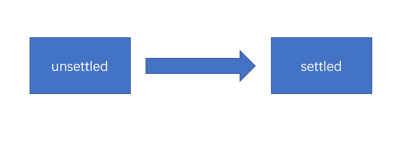

# Promise

## 事件循环

JS运行的环境称之为宿主环境。

执行栈：call stack，一个数据结构，用于存放各种函数的执行环境，每一个函数执行之前，它的相关信息会加入到执行栈。函数调用之前，创建执行环境，然后加入到执行栈；函数调用之后，销毁执行环境。

JS引擎永远执行的是执行栈的最顶部。

异步函数：某些函数不会立即执行，需要等到某个时机到达后才会执行，这样的函数称之为异步函数。比如事件处理函数。异步函数的执行时机，会被宿主环境控制。

浏览器宿主环境中包含5个线程：

1. JS引擎：负责执行执行栈的最顶部代码
2. GUI线程：负责渲染页面
3. 事件监听线程：负责监听各种事件
4. 计时线程：负责计时
5. 网络线程：负责网络通信

当上面的线程发生了某些事请，如果该线程发现，这件事情有处理程序，它会将该处理程序加入一个叫做事件队列的内存。当JS引擎发现，执行栈中已经没有了任何内容后，会将事件队列中的第一个函数加入到执行栈中执行。

JS引擎对事件队列的取出执行方式，以及与宿主环境的配合，称之为事件循环。

事件队列在不同的宿主环境中有所差异，大部分宿主环境会将事件队列进行细分。在浏览器中，事件队列分为两种：

- 宏任务（队列）：macroTask，计时器结束的回调、事件回调、http回调等等绝大部分异步函数进入宏队列
- 微任务（队列）：[MutationObserver](https://developer.mozilla.org/zh-CN/docs/Web/API/MutationObserver)，`Promise`产生的回调进入微队列

当执行栈清空时，JS引擎首先会将微任务中的所有任务依次执行结束，如果没有微任务，则执行宏任务。

## 事件和回调函数的缺陷

我们习惯于使用传统的回调或事件处理来解决异步问题

事件：某个对象的属性是一个函数，当发生某一件事时，运行该函数

回调：运行某个函数以实现某个功能的时候，传入一个函数作为参数，当发生某件事的时候，会运行该函数。

本质上，事件和回调并没有本质的区别，只是把函数放置的位置不同而已。

一直以来，该模式都运作良好。
直到前端工程越来越复杂...
目前，该模式主要面临以下两个问题：

1. 回调地狱：某个异步操作需要等待之前的异步操作完成，无论用回调还是事件，都会陷入不断的嵌套  
2. 异步之间的联系：某个异步操作要等待多个异步操作的结果，对这种联系的处理，会让代码的复杂度剧增

## 异步处理的通用模型

ES官方参考了大量的异步场景，总结出了一套异步的通用模型，该模型可以覆盖几乎所有的异步场景，甚至是同步场景。

值得注意的是，为了兼容旧系统，ES6 并不打算抛弃掉过去的做法，只是基于该模型推出一个全新的 API，使用该API，会让异步处理更加的简洁优雅。

理解该 API，最重要的，是理解它的异步模型

1. ES6 将某一件可能发生异步操作的事情，分为两个阶段：**unsettled** 和 **settled**

- unsettled： 未决阶段，表示事情还在进行前期的处理，并没有发生通向结果的那件事
- settled：已决阶段，事情已经有了一个结果，不管这个结果是好是坏，整件事情无法逆转

事情总是从 未决阶段 逐步发展到 已决阶段的。并且，未决阶段拥有控制何时通向已决阶段的能力。

2. ES6将事情划分为三种状态： pending、resolved、rejected

- pending: 挂起，处于未决阶段，则表示这件事情还在挂起（最终的结果还没出来）
- resolved：已处理，已决阶段的一种状态，表示整件事情已经出现结果，并是一个可以按照正常逻辑进行下去的结果
- rejected：已拒绝，已决阶段的一种状态，表示整件事情已经出现结果，并是一个无法按照正常逻辑进行下去的结果，通常用于表示有一个错误

既然未决阶段有权力决定事情的走向，因此，未决阶段可以决定事情最终的状态！

我们将 把事情变为resolved状态的过程叫做：**resolve**，推向该状态时，可能会传递一些数据

我们将 把事情变为rejected状态的过程叫做：**reject**，推向该状态时，同样可能会传递一些数据，通常为错误信息

**始终记住，无论是阶段，还是状态，是不可逆的！**

3. 当事情达到已决阶段后，通常需要进行后续处理，不同的已决状态，决定了不同的后续处理。

- resolved状态：这是一个正常的已决状态，后续处理表示为 thenable
- rejected状态：这是一个非正常的已决状态，后续处理表示为 catchable

后续处理可能有多个，因此会形成作业队列，这些后续处理会按照顺序，当状态到达后依次执行

4. 整件事称之为Promise

**细节:**

1. 未决阶段的处理函数是同步的，会立即执行
2. thenable和catchable函数是异步的，就算是立即执行，也会加入到事件队列中等待执行，并且，加入的队列是微队列
3. then可以只添加thenable函数，catch可以单独添加catchable函数
4. 在未决阶段的处理函数中，如果发生未捕获的错误，会将状态推向rejected，并会被catchable捕获
5. 一旦状态推向了已决阶段，无法再对状态做任何更改
6. **Promise并没有消除回调，只是让回调变得可控**

## Promise的串联

当后续的Promise需要用到之前的Promise的处理结果时，需要Promise的串联

Promise对象中，无论是then方法还是catch方法，它们都具有返回值，返回的是一个全新的Promise对象，它的状态满足下面的规则：

1. 如果当前的Promise是未决的，得到的新的Promise是挂起状态
2. 如果当前的Promise是已决的，会运行响应的后续处理函数，并将后续处理函数的结果（返回值）作为resolved状态数据，应用到新的Promise中；如果后续处理函数发生错误，则把返回值作为rejected状态数据，应用到新的Promise中。

注：**后续的Promise一定会等到前面的Promise有了后续处理结果后，才会变成已决状态**

如果前面的Promise的后续处理，返回的是一个Promise，则返回的新的Promise状态和后续处理返回的Promise状态保持一致。

##　Promise的api

- 原型成员 (实例成员)
  - then：注册一个后续处理函数，当Promise为resolved状态时运行该函数
  - catch：注册一个后续处理函数，当Promise为rejected状态时运行该函数
  - finally：[ES2018]注册一个后续处理函数（无参），当Promise为已决时运行该函数

- 构造函数成员 （静态成员）

  - resolve(数据)：该方法返回一个resolved状态的Promise，传递的数据作为状态数据
    - 特殊情况：如果传递的数据是Promise，则直接返回传递的Promise对象
  
  - reject(数据)：该方法返回一个rejected状态的Promise，传递的数据作为状态数据

  - all(iterable)：这个方法返回一个新的promise对象，该promise对象在iterable参数对象里所有的promise对象都成功的时候才会触发成功，一旦有任何一个iterable里面的promise对象失败则立即触发该promise对象的失败。这个新的promise对象在触发成功状态以后，会把一个包含iterable里所有promise返回值的数组作为成功回调的返回值，顺序跟iterable的顺序保持一致；如果这个新的promise对象触发了失败状态，它会把iterable里第一个触发失败的promise对象的错误信息作为它的失败错误信息。Promise.all方法常被用于处理多个promise对象的状态集合。

  - race(iterable)：当iterable参数里的任意一个子promise被成功或失败后，父promise马上也会用子promise的成功返回值或失败详情作为参数调用父promise绑定的相应句柄，并返回该promise对象