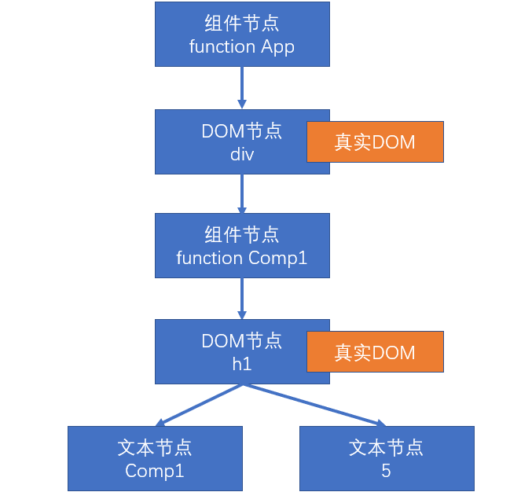

# React基础知识

> 官网：https://react.docschina.org/

## 什么是React？

React是由**Facebook**研发的、用于**解决UI复杂度**的开源**JavaScript库**，目前由React联合社区维护。

> 它不是框架，只是为了解决UI复杂度而诞生的一个库

## React的特点

- 轻量：React的开发版所有源码（包含注释）仅3000多行
- 原生：所有的React的代码都是用原生JS书写而成的，不依赖其他任何库
- 易扩展：React对代码的封装程度较低，也没有过多的使用魔法，所以React中的很多功能都可以扩展。
- 不依赖宿主环境：React只依赖原生JS语言，不依赖任何其他东西，包括运行环境。因此，它可以被轻松的移植到浏览器、桌面应用、移动端。
- 渐近式：React并非框架，对整个工程没有强制约束力。这对与那些已存在的工程，可以逐步的将其改造为React，而不需要全盘重写。
- 单向数据流：所有的数据自顶而下的流动
- 用JS代码声明界面
- 组件化

## 对比Vue

|   对比项   |  Vue  | React |
| :--------: | :---: | :---: |
| 全球使用量 |       |   ✔   |
| 国内使用量 |   ✔   |       |
|    性能    |   ✔   |   ✔   |
|   易上手   |   ✔   |       |
|   灵活度   |       |   ✔   |
|  大型企业  |       |   ✔   |
| 中小型企业 |   ✔   |       |
|    生态    |       |   ✔   |

## 组件状态 props 和 state

1. props：该数据是由组件的使用者传递的数据，所有权不属于组件自身，因此组件无法改变该数组
2. state：该数组是由组件自身创建的，所有权属于组件自身，因此组件有权改变该数据

## 事件

在React中，组件的事件，本质上就是一个属性

由于事件本质上是一个属性，因此也需要使用小驼峰命名法

**如果没有特殊处理，在事件处理函数中，this指向undefined**

1. 使用bind函数，绑定this
2. 使用箭头函数

## 深入认识 setState

setState，它对状态的改变，**可能**是异步的

> 如果改变状态的代码处于某个HTML元素的事件中，则其是异步的，否则是同步

如果遇到某个事件中，需要同步调用多次，需要使用函数的方式得到最新状态

最佳实践：

1. 把所有的setState当作是异步的
2. 永远不要信任setState调用之后的状态
3. 如果要使用改变之后的状态，需要使用回调函数（setState的第二个参数,所有状态全部更新完成，并且重新渲染后执行）
4. 如果新的状态要根据之前的状态进行运算，使用函数的方式改变状态（setState的第一个参数）

React会对异步的setState进行优化，将多次setState进行合并（将多次状态改变完成后，再统一对state进行改变，然后触发render）

## 生命周期

生命周期：组件从诞生到销毁会经历一系列的过程，该过程就叫做生命周期。
React在组件的生命周期中提供了一系列的钩子函数（类似于事件），可以让开发者在函数中注入代码，这些代码会在适当的时候运行。

**生命周期仅存在于类组件中，函数组件每次调用都是重新运行函数，旧的组件即刻被销毁**

### 旧版生命周期

React < 16.0.0


1. constructor
   1. 同一个组件对象只会创建一次
   2. 不能在第一次挂载到页面之前，调用setState，为了避免问题，构造函数中严禁使用setState
2. componentWillMount
   1. 正常情况下，和构造函数一样，它只会运行一次
   2. 可以使用setState，但是为了避免bug，不允许使用，因为在某些特殊情况下，该函数可能被调用多次
3. **render**
   1. 返回一个虚拟DOM，会被挂载到虚拟DOM树中，最终渲染到页面的真实DOM中
   2. render可能不只运行一次，只要需要重新渲染，就会重新运行
   3. 严禁使用setState，因为可能会导致无限递归渲染
4. **componentDidMount**
   1. 只会执行一次
   2. 可以使用setState
   3. 通常情况下，会将网络请求、启动计时器等一开始需要的操作，书写到该函数中
5. 组件进入活跃状态
6. componentWillReceiveProps
   1. 即将接收新的属性值
   2. 参数为新的属性对象
   3. 该函数可能会导致一些bug，所以不推荐使用
7. **shouldComponentUpdate**
   1. 指示React是否要重新渲染该组件，通过返回true和false来指定
   2. 默认情况下，会直接返回true
8. componentWillUpdate
   1. 组件即将被重新渲染
9. componentDidUpdate
   1.  往往在该函数中使用dom操作，改变元素
10. **componentWillUnmount**
    1.  通常在该函数中销毁一些组件依赖的资源，比如计时器

## 新版生命周期

React >= 16.0.0


React官方认为，某个数据的来源必须是单一的

1. getDerivedStateFromProps
   1. 通过参数可以获取新的属性和状态
   2. 该函数是静态的
   3. 该函数的返回值会覆盖掉组件状态
   4. 该函数几乎是没有什么用
2. getSnapshotBeforeUpdate
   1. 真实的DOM构建完成，但还未实际渲染到页面中。
   2. 在该函数中，通常用于实现一些附加的dom操作
   3. 该函数的返回值，会作为componentDidUpdate的第三个参数

## 传递元素内容

```jsx
<Comp>
    <h1>传递元素内容内容</h1>
</Comp>
```

```js
export default function Comp(props) {
    console.log(props);
    return (
        <div className="comp">
            <h1>组件自身的内容</h1>
            {/* {props.children == <h1>传递元素内容内容</h1>} */}
            {props.children}
        </div>
    )
}
```

如果给自定义组件传递元素内容，则React会将元素内容作为children属性传递过去。

## 属性默认值 和 类型检查

## 属性默认值

通过一个静态属性```defaultProps```告知react属性默认值

## 属性类型检查

使用库： [prop-types](https://www.npmjs.com/package/prop-types)

```js
import React, { Component } from 'react'
import PropTypes from "prop-types";

export class A {

}

export class B extends A {

}
export default class ValidationComp extends Component {
    //先混合属性
    static defaultProps = {
        b: false
    }

    //再调用相应的函数进行验证
    static propTypes = {
        a: PropTypes.number.isRequired,  //a属性必须是一个数字类型,并且必填
        b: PropTypes.bool.isRequired, //b必须是一个bool属性,并且必填
        onClick: PropTypes.func, //onClick必须是一个函数
        c: PropTypes.any, //1. 可以设置必填   2. 阵型保持整齐（所有属性都在该对象中）
        d: PropTypes.node.isRequired, //d必填，而且必须是一个可以渲染的内容，字符串、数字、React元素
        e: PropTypes.element, //e必须是一个React元素
        F: PropTypes.elementType, //F必须是一个组件类型
        g: PropTypes.instanceOf(A), //g必须是A的实例
        sex: PropTypes.oneOf(["男", "女"]), //属性必须是数组当中的一个
        h: PropTypes.arrayOf(PropTypes.number), //数组的每一项必须满足类型要求
        i: PropTypes.objectOf(PropTypes.number), //每一个属性必须满足类型要求
        j: PropTypes.shape({ //属性必须满足该对象的要求
            name: PropTypes.string.isRequired, //name必须是一个字符串，必填
            age: PropTypes.number, //age必须是一个数字
            address: PropTypes.shape({
                province: PropTypes.string,
                city: PropTypes.string
            })
        }),
        k: PropTypes.arrayOf(PropTypes.shape({
            name: PropTypes.string.isRequired,
            age: PropTypes.number.isRequired
        })),
        m: PropTypes.oneOfType([PropTypes.string, PropTypes.number]),
        score: function (props, propName, componentName) {
            console.log(props, propName, componentName);
            const val = props[propName];
            //必填
            if (val === undefined || val === null) {
                return new Error(`invalid prop ${propName} in ${componentName}，${propName} is Required`);
            }
            //该属性必须是一个数字
            if (typeof val !== "number") {
                return new Error(`invalid prop ${propName} in ${componentName}，${propName} is not a number`);
            }
            const err = PropTypes.number.isRequired(props, propName, componentName);
            if(err){
                return err;
            }
            //并且取值范围是0~100
            if (val < 0 || val > 100) {
                return new Error(`invalid prop ${propName} in ${componentName}，${propName} must is between 0 and 100`);
            }
        }
    }

    render() {
        const F = this.props.F;
        return (
            <div>
                {this.props.a}
                <div>
                    {this.props.d}
                    <F />
                </div>
            </div>
        )
    }
}
```

## HOC 高阶组件

HOF：Higher-Order Function, 高阶函数，以函数作为参数，并返回一个函数
HOC: Higher-Order Component, 高阶组件，以组件作为参数，并返回一个组件

通常，可以利用HOC实现横切关注点。

举例：20个组件，每个组件在创建组件和销毁组件时，需要作日志记录
> 20个组件，它们需要显示一些内容，得到的数据结构完全一致

**注意**:

1. 不要在render中使用高阶组件
2. 不要在高阶组件内部更改传入的组件

## ref

reference: 引用

场景：希望直接使用dom元素中的某个方法，或者希望直接使用自定义组件中的某个方法

1. ref作用于内置的html组件，得到的将是真实的dom对象
2. ref作用于类组件，得到的将是类的实例
3. ref不能作用于函数组件

ref不再推荐使用字符串赋值，字符串赋值的方式将来可能会被移出
目前，ref推荐使用对象或者是函数

**对象**

通过 React.createRef 函数创建

**函数**

函数的调用时间：

1. componentDidMount(组件挂载完成)的时候会调用该函数
   1. 在componentDidMount事件中可以使用ref
2. 如果ref的值发生了变动（旧的函数被新的函数替代），分别调用旧的函数以及新的函数，时间点出现在componentDidUpdate之前
   1. 旧的函数被调用时，传递null
   2. 新的函数被调用时，传递对象
3. 如果ref所在的组件被卸载，会调用函数

**谨慎使用ref**

能够使用属性和状态进行控制，就不要使用ref。

1. 调用真实的DOM对象中的方法
2. 某个时候需要调用类组件的方法

## Ref转发

React.forwardRef方法：

1. 参数，传递的是函数组件，不能是类组件，并且，函数组件需要有第二个参数来得到ref
2. 返回值，返回一个新的组件

使用:

```jsx
import React from 'react'

function A(props, ref) {
    return <h1 ref={ref}>
        组件A
        <span>{props.words}</span>
    </h1>
}

//传递函数组件A，得到一个新组件NewA
const NewA = React.forwardRef(A);

export default class App extends React.Component {

    ARef = React.createRef()

    componentDidMount() {
        console.log(this.ARef); //null
    }


    render() {
        return (
            <div>
                <NewA ref={this.ARef} words="asfsafasfasfs" />
                {/* this.ARef.current:  h1 */}
            </div>
        )
    }
}

```

## Context

上下文：Context，表示做某一些事情的环境

React中的上下文特点：

1. 当某个组件创建了上下文后，上下文中的数据，会被所有后代组件共享
2. 如果某个组件依赖了上下文，会导致该组件不再纯粹（外部数据仅来源于属性props）
3. 一般情况下，用于第三方组件（通用组件）

### 旧的API

**创建上下文**：

只有类组件才可以创建上下文

1. 给类组件书写静态属性 childContextTypes，使用该属性对上下文中的数据类型进行约束
2. 添加实例方法 getChildContext，该方法返回的对象，即为上下文中的数据，该数据必须满足类型约束，该方法会在每次render之后运行

**使用上下文中的数据**：

要求：如果要使用上下文中的数据，组件必须有一个静态属性 contextTypes，该属性描述了需要获取的上下文中的数据类型

1. 可以在组件的构造函数中，通过第二个参数，获取上下文数据
2. **从组件的context属性中获取**
3. 在函数组件中，通过第二个参数，获取上下文数据

**上下文的数据变化**：

上下文中的数据不可以直接变化，最终都是通过状态改变

在上下文中加入一个处理函数，可以用于后代组件更改上下文的数据

### 新版API

旧版API存在严重的效率问题，并且容易导致滥用

**创建上下文**

上下文是一个独立于组件的对象，该对象通过React.createContext(默认值)创建

返回的是一个包含两个属性的对象

1. Provider属性：生产者。一个组件，该组件会创建一个上下文，该组件有一个value属性，通过该属性，可以为其数据赋值
   1. 同一个Provider，不要用到多个组件中，如果需要在其他组件中使用该数据，应该考虑将数据提升到更高的层次
2. Consumer属性：后续讲解

**使用上下文中的数据**：

1. 在类组件中，直接使用this.context获取上下文数据
   1. 要求：必须拥有静态属性 contextType , 应赋值为创建的上下文对象
2. 在函数组件中，需要使用Consumer来获取上下文数据
   1. Consumer是一个组件
   2. 它的子节点，是一个函数（它的props.children需要传递一个函数）

**注意细节**：

如果，上下文提供者（Context.Provider）中的value属性发生变化(Object.is比较)，会导致该上下文提供的所有后代元素全部重新渲染，无论该子元素是否有优化（无论shouldComponentUpdate函数返回什么结果）

## PureComponent

纯组件，用于避免不必要的渲染（运行render函数），从而提高效率

优化：如果一个组件的属性和状态都没有发生变化，重新渲染组件是没有必要的

```PureComponent```是一个组件，如果某个组件继承该组件，则该组件的```shouldComponentUpdate```会进行优化，对属性和状态进行浅比较，如果相等则不进行重新渲染。

**注意**：

1. ```PureComponent```是进行浅比较
    1. 为了效率，应该尽量使用```PureComponent```
    2. 要求不改动之前的状态，永远是创建新的状态覆盖之前的状态（ Immutable，不可变对象）
    3. 第三方库js库，Immutable.js，专门用于制作不可变对象
2. 函数组件,使用```React.memo```函数制作纯函数
    1. ```React.memo```是一个高阶函数，其原理是返回一个纯组件渲染该函数组件

```js
function memo(FuncComp){
    return class Memo extend PureComponent {
        render() {
            return <>
                {FuncComp(this.prop)}
            <>
        }
    }
}
```

## Portals

插槽：将一个React元素渲染到指定的DOM容器中

ReactDOM.createPortal(React元素, 真实的DOM容器)，该函数返回一个React元素

**注意事件冒泡**

1. React中的事件是包装过的
2. 它的事件冒泡是根据虚拟DOM树来冒泡的，与真实的DOM树无关。

## 错误边界

默认情况下，若一个组件在**渲染期间**（render）发生错误，会导致整个组件树全部被卸载

错误边界：是一个组件，该组件会捕获到渲染期间（render）子组件发生的错误，并有能力阻止错误继续传播

**让某个组件捕获错误**

1. 编写生命周期函数 getDerivedStateFromError
   1. 静态函数
   2. 运行时间点：渲染子组件的过程中，发生错误之后，在更新页面之前
   3. **注意：只有子组件发生错误，才会运行该函数**
   4. 该函数返回一个对象，React会将该对象的属性覆盖掉当前组件的state
   5. 参数：错误对象
   6. 通常，该函数用于改变状态
2. 编写生命周期函数 componentDidCatch
   1. 实例方法
   2. 运行时间点：渲染子组件的过程中，发生错误，更新页面之后，由于其运行时间点比较靠后，因此不太会在该函数中改变状态
   3. 通常，该函数用于记录错误消息

## # React中的事件

React内置的DOM组件中的事件

1. 给document注册事件
2. 几乎所有的元素的事件处理，均在document的事件中处理
   1. 一些不冒泡的事件，是直接在元素上监听
   2. 一些document上面没有的事件，直接在元素上监听
3. 在document的事件处理，React会根据虚拟DOM树的完成事件函数的调用
4. React的事件参数，并非真实的DOM事件参数，是React合成的一个对象，该对象类似于真实DOM的事件参数
   1. stopPropagation，阻止事件在虚拟DOM树中冒泡
   2. nativeEvent，可以得到真实的DOM事件对象
   3. 为了提高执行效率，React使用事件对象池来处理事件对象

**注意事项**

1. 如果给真实的DOM注册事件，阻止了事件冒泡，则会导致react的相应事件无法触发
2. 如果给真实的DOM注册事件，事件会先于React事件运行
3. 通过React的事件中阻止事件冒泡，无法阻止真实的DOM事件冒泡
4. 可以通过nativeEvent.stopImmediatePropagation()，阻止document上剩余事件的执行
5. 在事件处理程序中，不要异步的使用事件对象，如果一定要使用，需要调用persist函数

## 渲染原理

渲染：生成用于显示的对象，以及将这些对象形成真实的DOM对象

- React元素：React Element，通过React.createElement创建（语法糖：JSX）
  - 例如：
  - ```<div><h1>标题</h1></div>```
  - ```<App />```
- React节点：专门用于渲染到UI界面的对象，React会通过React元素，创建React节点，ReactDOM一定是通过React节点来进行渲染的
- 节点类型：
  - React DOM节点：创建该节点的React元素类型是一个字符串
  - React 组件节点：创建该节点的React元素类型是一个函数或是一个类
  - React 文本节点：由字符串、数字创建的
  - React 空节点：由null、undefined、false、true
  - React 数组节点：该节点由一个数组创建
- 真实DOM：通过document.createElement创建的dom元素


### 首次渲染(新节点渲染)

1. 通过参数的值创建节点
2. 根据不同的节点，做不同的事情
   1. 文本节点：通过document.createTextNode创建真实的文本节点
   2. 空节点：什么都不做
   3. 数组节点：遍历数组，将数组每一项递归创建节点（回到第1步进行反复操作，直到遍历结束）
   4. DOM节点：通过document.createElement创建真实的DOM对象，然后立即设置该真实DOM元素的各种属性，然后遍历对应React元素的children属性，递归操作（回到第1步进行反复操作，直到遍历结束）
   5. 组件节点
      1. 函数组件：调用函数(该函数必须返回一个可以生成节点的内容)，将该函数的返回结果递归生成节点（回到第1步进行反复操作，直到遍历结束）
      2. 类组件：
         1. 创建该类的实例
         2. 立即调用对象的生命周期方法：static getDerivedStateFromProps
         3. 运行该对象的render方法，拿到节点对象（将该节点递归操作，回到第1步进行反复操作）
         4. 将该组件的componentDidMount加入到执行队列（先进先出，先进先执行），当整个虚拟DOM树全部构建完毕，并且将真实的DOM对象加入到容器中后，执行该队列
3. 生成出虚拟DOM树之后，将该树保存起来，以便后续使用
4. 将之前生成的真实的DOM对象，加入到容器中。

```jsx
const app = <div className="assaf">
    <h1>
        标题
        {["abc", null, <p>段落</p>]}
    </h1>
    <p>
        {undefined}
    </p>
</div>;
ReactDOM.render(app, document.getElementById('root'));
```

以上代码生成的虚拟DOM树：


```js

function Comp1(props) {
    return <h1>Comp1 {props.n}</h1>
}

function App(props) {
    return (
        <div>
            <Comp1 n={5} />
        </div>
    )
}

const app = <App />;
ReactDOM.render(app, document.getElementById('root'));
```

以上代码生成的虚拟DOM树：




```js
class Comp1 extends React.Component {
    render() {
        return (
            <h1>Comp1</h1>
        )
    }
}

class App extends React.Component {
    render() {
        return (
            <div>
                <Comp1 />
            </div>
        )
    }
}

const app = <App />;
ReactDOM.render(app, document.getElementById('root'));
```

以上代码生成的虚拟DOM树：


### 更新节点

更新的场景：

1. 重新调用ReactDOM.render，触发根节点更新
2. 在类组件的实例对象中调用setState，会导致该实例所在的节点更新

**节点的更新**

- 如果调用的是ReactDOM.render，进入根节点的**对比（diff）更新**
- 如果调用的是setState
  - 1. 运行生命周期函数，static getDerivedStateFromProps
  - 2. 运行shouldComponentUpdate，如果该函数返回false，终止当前流程 
  - 3. 运行render，得到一个新的节点，进入该新的节点的**对比更新**
  - 4. 将生命周期函数getSnapshotBeforeUpdate加入执行队列，以待将来执行
  - 5. 将生命周期函数componentDidUpdate加入执行队列，以待将来执行

后续步骤：
1. 更新虚拟DOM树
2. 完成真实的DOM更新
3. 依次调用执行队列中的componentDidMount
4. 依次调用执行队列中的getSnapshotBeforeUpdate
5. 依次调用执行队列中的componentDidUpdate

#### 对比更新

将新产生的节点，对比之前虚拟DOM中的节点，发现差异，完成更新

问题：对比之前DOM树中哪个节点

React为了提高对比效率，做出以下假设

1. 假设节点不会出现层次的移动（对比时，直接找到旧树中对应位置的节点进行对比）
2. 不同的节点类型会生成不同的结构
   1. 相同的节点类型：节点本身类型相同，如果是由React元素生成，type值还必须一致
   2. 其他的，都属于不相同的节点类型
3. 多个兄弟通过唯一标识（key）来确定对比的新节点

key值的作用：用于通过旧节点，寻找对应的新节点，如果某个旧节点有key值，则其更新时，会寻找相同层级中的相同key值的节点，进行对比。

**key值应该在一个范围内唯一（兄弟节点中），并且应该保持稳定**

##### 找到了对比的目标

判断节点类型是否一致

- **一致**

根据不同的节点类型，做不同的事情

**空节点**：不做任何事情

**DOM节点**：
1. 直接重用之前的真实DOM对象
2. 将其属性的变化记录下来，以待将来统一完成更新（现在不会真正的变化）
3. 遍历该新的React元素的子元素，**递归对比更新**

**文本节点**：
1. 直接重用之前的真实DOM对象
2. 将新的文本变化记录下来，将来统一完成更新

**组件节点**：

- **函数组件**：重新调用函数，得到一个节点对象，进入**递归对比更新**

- **类组件**：

1. 重用之前的实例
2. 调用生命周期方法getDerivedStateFromProps
3. 调用生命周期方法shouldComponentUpdate，若该方法返回false，终止
4. 运行render，得到新的节点对象，进入**递归对比更新**
5. 将该对象的getSnapshotBeforeUpdate加入队列
6. 将该对象的componentDidUpdate加入队列

- **不一致**

整体上，卸载旧的节点，全新创建新的节点

**创建新节点**

进入新节点的挂载流程

**卸载旧节点**

1. **文本节点、DOM节点、数组节点、空节点、函数组件节点**：直接放弃该节点，如果节点有子节点，递归卸载节点
2. **类组件节点**：
   1. 直接放弃该节点
   2. 调用该节点的componentWillUnMount函数
   3. 递归卸载子节点

##### 没有找到对比的目标

新的DOM树中有节点被删除

新的DOM树中有节点添加

- 创建新加入的节点
- 卸载多余的旧节点

## 严格模式

StrictMode(```React.StrictMode```)，本质是一个组件，该组件不进行UI渲染（```React.Fragment <> </>```），它的作用是，在渲染内部组件时，发现不合适的代码。

- 识别不安全的生命周期
- 关于使用过时字符串 ref API 的警告
- 关于使用废弃的 findDOMNode 方法的警告
- 检测意外的副作用
  - React要求，副作用代码仅出现在以下生命周期函数中
  - 1. ComponentDidMount
  - 2. ComponentDidUpdate
  - 3. ComponentWillUnMount

副作用：一个函数中，做了一些会影响函数外部数据的事情，例如：

1. 异步处理
2. 改变参数值
3. setState
4. 本地存储
5. 改变函数外部的变量

相反的，如果一个函数没有副作用，则可以认为该函数是一个纯函数

在严格模式下，虽然不能监控到具体的副作用代码，但它会将不能具有副作用的函数调用两遍，以便发现问题。（这种情况，仅在开发模式下有效）

- 检测过时的 context API

## Profiler

性能分析工具

分析某一次或多次提交（更新），涉及到的组件的渲染时间

火焰图：得到某一次提交，每个组件总的渲染时间以及自身的渲染时间

排序图：得到某一次提交，每个组件自身渲染时间的排序

组件图：某一个组件，在多次提交中，自身渲染花费的时间